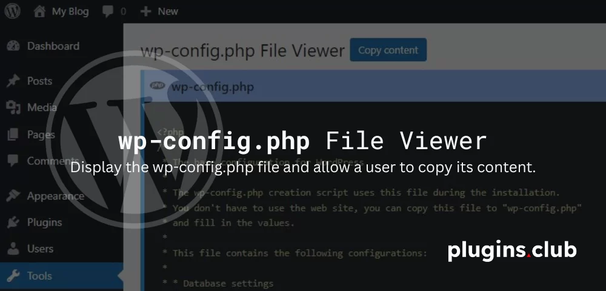
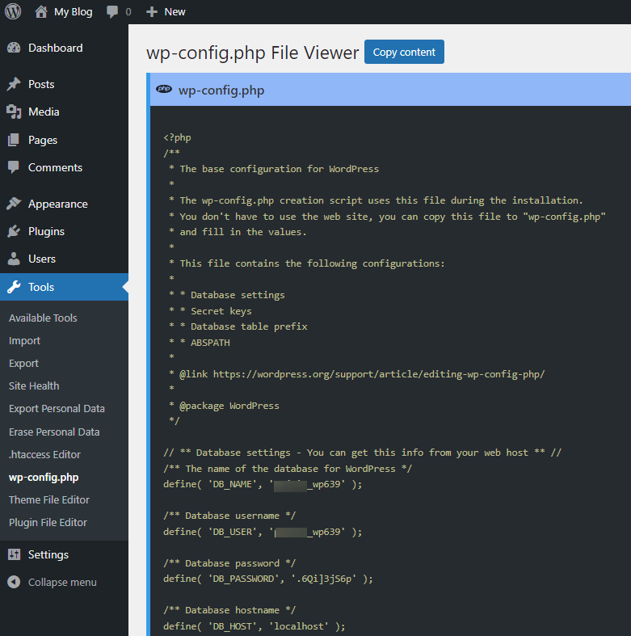

# wp-config.php File Viewer WordPress plugin

One of the most important files in your WordPress installation is the wp-config.php file. This file is located in the root of your WordPress file directory and contains your website’s base configuration details, such as database connection information.

Occasionally site Admins need to view this file, for example in order to log in to PHPMyAdmin We need to check the database name first or when troubleshooting an issue to check if a constant is enabled in the wp-config.php file.

To view the content of the wp-config.php file you need to login to the server either via sFTP or a File Manager, then navigate to the website root directory and open the file in an editor program.

To simplify the process, I have created this simple WordPress plugin that displays the wp-config.php file and allows a user to copy its content.

Install and activate the plugin, then navigate to **Tools > wp-config.php** when you need to view it.

To copy file content simply click on the “Copy Content” button on the top.

